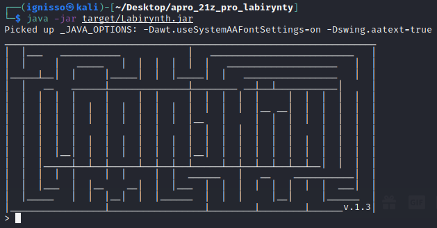

# Labirynth-Generator



## General info
Labirynth generator and solver with multiple ways to import/export and friendly looking shell written in Java. Project realised during subject **Algorithms and Data Structures 1** on **Warsaw University of Technoloy**.

## Technologies
* Java 17

## Setup
To run this project pull it from GitLab and use commands bellow depending on your OS:
### Windows
```
build.bat
java -jar Labirynth.jar
```
### Linux
```
build.sh
java -jar Labirynth.jar
```

## Features
- Generate labirynth 
	- size
	- seed
- Solve labirynth
	- starting point
	- ending point

- Export/Import to/from file
	- binary
	- text
	- bitmap

### To Do:
[ ] GUI
[ ] More custiomization during labirynth generation
